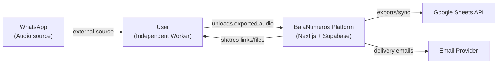
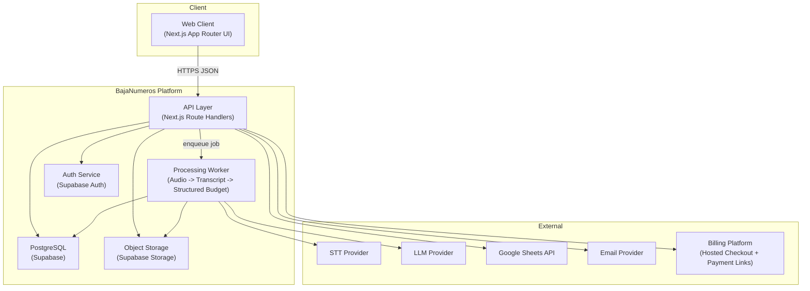
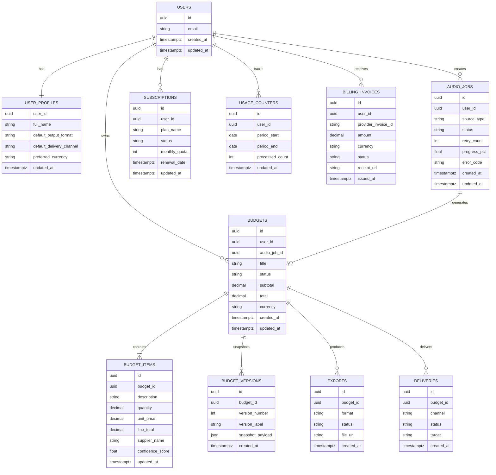
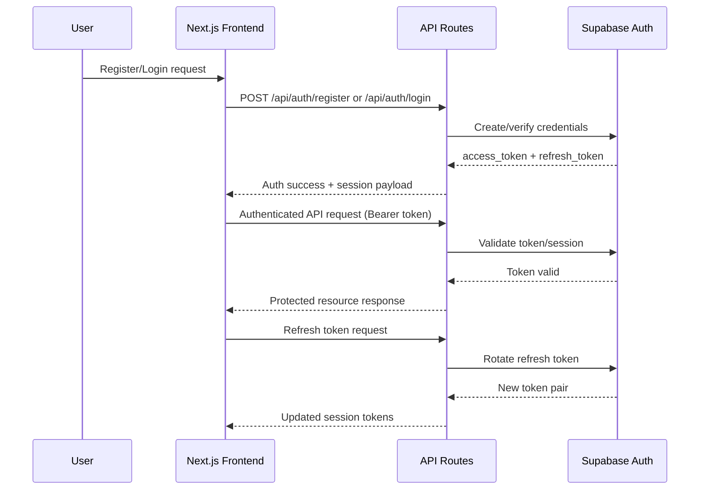

# BajaNumeros! - Architecture Specifications (MVP)

## 1) System Architecture (C4 Level 1-2, Mermaid)

### C4 Level 1 - System Context

### C4 Level 2 - Container View

---

## 2) Database Design (ERD, Mermaid)

> Importante: este ERD representa el **modelo conceptual del MVP**. El schema fisico final y sus columnas exactas se validaran con Supabase MCP en tiempo real durante implementacion; no se define SQL estatico aqui.

---

## 3) Tech Stack Justification

- **Frontend/Full-stack framework: Next.js 15 (App Router)**
  - ✅ Server Components and Route Handlers improve performance and simplify architecture.
  - ✅ Single codebase for UI + API speeds MVP delivery.
  - ✅ Good fit for Vercel deployment pipeline.
  - ❌ Trade-off: App Router patterns require team discipline and conventions.

- **Backend Data/Auth: Supabase (PostgreSQL + Auth + Storage)**
  - ✅ Managed Postgres with RLS supports multi-tenant security quickly.
  - ✅ Built-in Auth and Storage reduce integration overhead.
  - ✅ Strong developer velocity for MVP iterations.
  - ❌ Trade-off: deeper lock-in to Supabase service model and quotas.

- **Hosting/CDN: Vercel**
  - ✅ Optimized for Next.js runtime and preview workflows.
  - ✅ Edge caching and global delivery for static assets.
  - ✅ Fast CI-to-production path with environment separation.
  - ❌ Trade-off: serverless runtime constraints for long-running tasks.

- **CI/CD: GitHub Actions**
  - ✅ Standardized quality gates (lint, test, type-check).
  - ✅ Native PR workflow integration and auditability.
  - ✅ Reusable workflows for multi-environment deploy controls.
  - ❌ Trade-off: pipeline complexity can grow without strict templates.

- **External Processing: STT + LLM providers**
  - ✅ Best-in-class specialized models for speech and structuring tasks.
  - ✅ Faster accuracy improvements than building in-house models.
  - ✅ Provider abstraction allows iterative quality/cost tuning.
  - ❌ Trade-off: variable costs and dependency on external SLAs.

- **Billing: Provider-agnostic adapter + hosted checkout links**
  - ✅ Lets each user choose available payment method at checkout.
  - ✅ Reduces dependency on local payment constraints per country.
  - ✅ Simplifies future provider swaps using a stable internal interface.
  - ❌ Trade-off: requires stricter abstraction design and webhook normalization.

---

## 4) Data Flow (request -> response)

### Flow A: Audio Upload to Editable Budget

1. User uploads WhatsApp-exported audio in web app.
2. Client validates file type/size and sends `POST /api/audio-jobs`.
3. API authenticates user, checks plan quota, stores file metadata, creates `audio_job`.
4. API enqueues processing task and returns `202 accepted` with `job_id`.
5. Worker retrieves file from storage and sends audio to STT provider.
6. Worker sends transcript to LLM extraction service to get structured items.
7. Worker persists draft budget + items and marks job as `ready`.
8. Client polls `GET /api/audio-jobs/{jobId}` until status is `ready`.
9. User opens budget draft, edits fields, saves version, and exports.

### Flow B: Export and Delivery

1. User requests export (`POST /api/budgets/{id}/export/excel` or `/google-sheets`).
2. API validates plan permission and budget state.
3. Export artifact is generated and recorded in `exports`.
4. User triggers delivery via email/share link (`POST /api/budgets/{id}/deliveries`).
5. Delivery outcome is stored and shown in history.
6. Billing status changes are synchronized asynchronously via webhook (`POST /api/billing/webhook`).

### Flow C: Subscription Payment with User-selected Method

1. User selects target plan and preferred payment method in subscription screen.
2. Client sends `POST /api/subscription/checkout-link`.
3. API validates plan transition and selected payment method.
4. Billing adapter creates hosted checkout/payment link and returns `checkout_url`.
5. User completes payment on provider-hosted page.
6. Provider sends webhook event to `POST /api/billing/webhook`.
7. API verifies signature, checks idempotency by `event_id`, and updates subscription/invoice status.
8. Client fetches updated state from `GET /api/subscription` and `GET /api/billing/invoices`.

---

## 5) Security Architecture

### 5.1 Auth Flow Diagram (login, registration, token refresh)

### 5.2 RBAC Implementation

- Roles in MVP:
  - `user`: default role, access only own data.
  - `admin_ops`: operational role for support-level investigation (restricted, audited).
- Enforcement layers:
  - API middleware checks authenticated context and role-based action permissions.
  - PostgreSQL RLS enforces row ownership (`user_id = auth.uid()`) on user-domain tables.
  - Admin paths isolated and logged with explicit reason codes.

### 5.3 Data Protection

- Encryption at rest via Supabase managed infrastructure.
- TLS for all external/internal transport.
- Input sanitization and schema validation on all mutable endpoints.
- Signed URLs with expiration for exported file access.
- Secrets managed via environment variables in Vercel/GitHub Actions; never exposed to client.
- Structured logs with masked sensitive fields and correlation IDs for audits.

---

## Architecture Decision Summary

- Prioritize rapid MVP validation with a single full-stack runtime and managed data/auth platform.
- Keep processing asynchronous to protect UX from long audio operations.
- Use clear tenant isolation (RLS) from day one to avoid future migration risk.
- Constrain MVP ingestion to WhatsApp audio only to minimize system complexity and launch risk.
- Use a provider-agnostic billing strategy with hosted checkout links and normalized webhook events.
